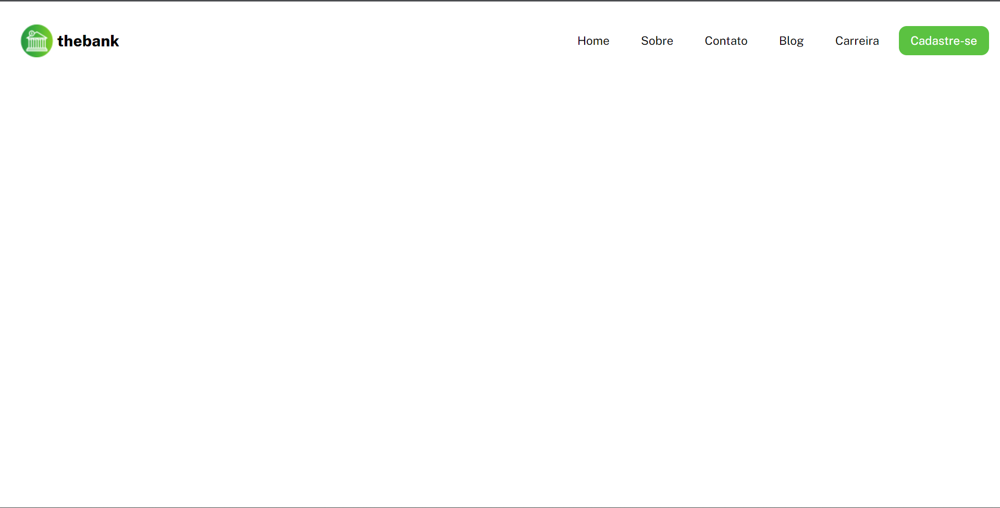
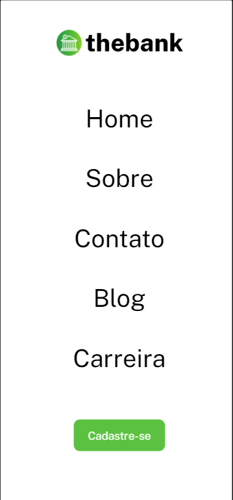

# Layout menu: thebank

## Visualização em desktop

 

## Visualização em dispositivos móveis

(Pressione CTRL + clique na imagem para abrir o projeto em uma nova guia)

 

## Linguagens utilizadas:

- HTML
- CSS

 

Projeto web desenvolvido usando como inspiração um desafio do site figma.

Para acessar o projeto original do figma, <a href="https://www.figma.com/file/DYk9DZr6urB9MZ4iNt1a61/Desafio-HTML-%2B-CSS?node-id=0%3A1&t=gtJsJ5oadyx3TVjz-0">clique aqui</a>.
